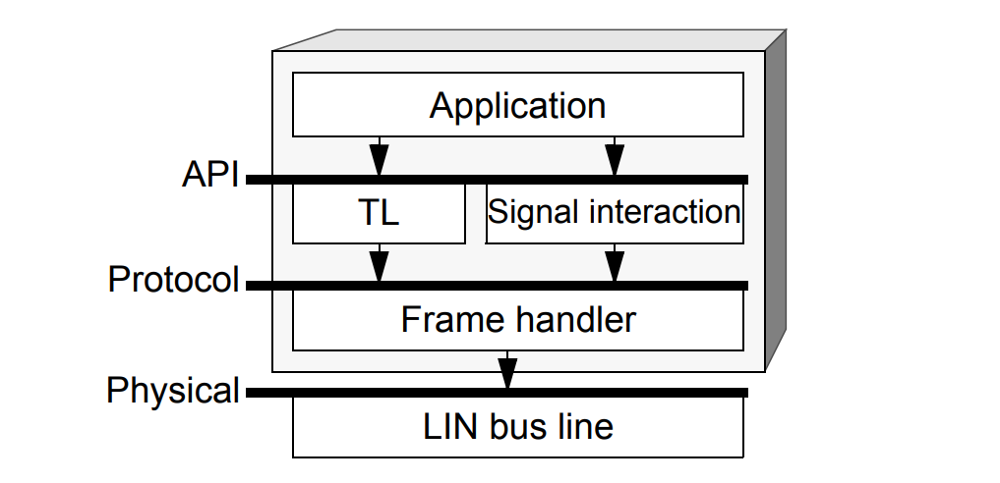
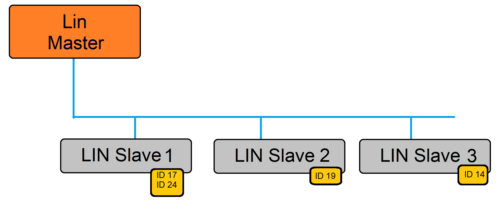
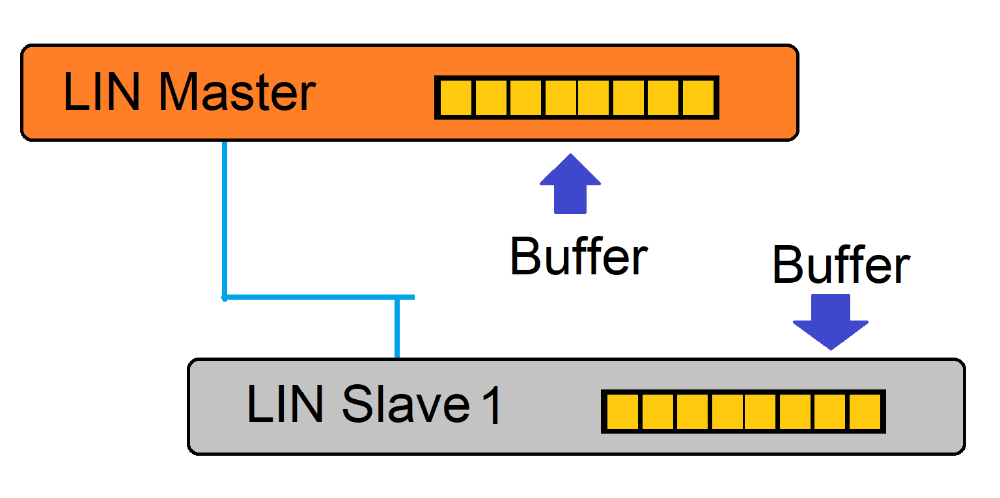
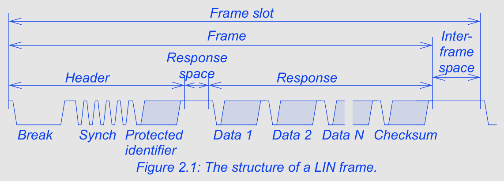
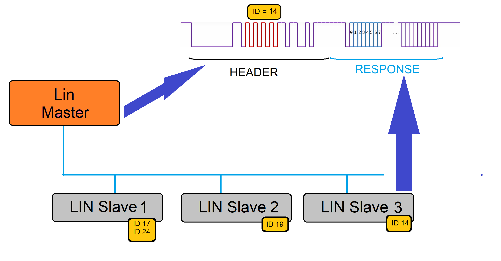
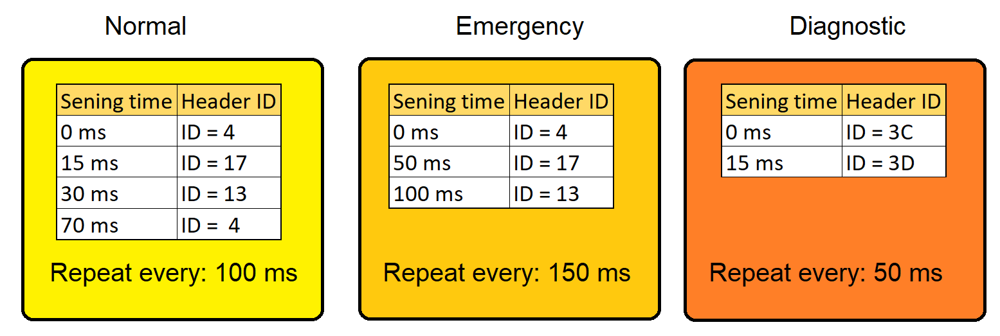
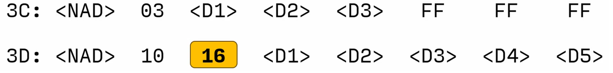
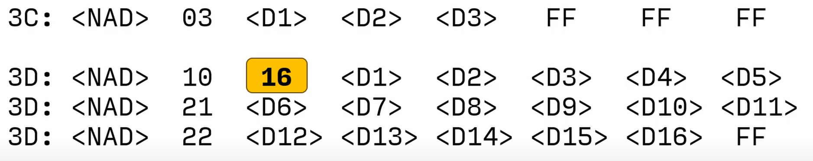
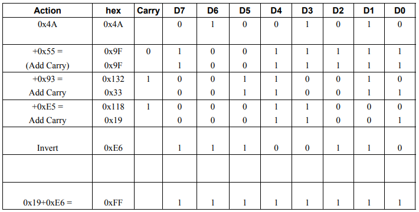
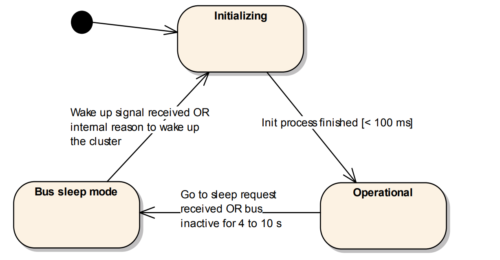

# LIN Protocol Overview

This repository contains a concise overview of the LIN (Local Interconnect Network) protocol used in automotive embedded systems.

---

## Historical Overview

LIN (Local Interconnect Network) is a cost-effective serial network protocol because it requires only microcontrollers with UART for communication between various components within vehicles. It operates on a single wire and supports communication speeds of up to **19.2 Kbit/s** over a **40-meter bus length**.

The protocol was developed as a cheaper alternative to CAN for simple nodes in automotive systems.

In the late 1990s, the LIN Consortium was established by companies such as:

- BMW
- Volkswagen Group
- Audi
- Volvo Cars
- Mercedes-Benz

Supported by Volcano Automotive Group and Motorola, this led to:

- LIN 1.3 → November 2002
- LIN 2.0 → September 2003

---


---

## Introduction

A LIN node communicates with the bus through a transceiver. The architecture includes:

- Application layer
- Transport layer
- Frame handler
- Physical interface

The application does not directly access frames — instead, a signal-based interaction layer is used.

---



---

## LIN Bus

- Single master, up to **16 slave nodes**
- No collision detection
- Master controls communication
- Often connected to a CAN network via gateway

---



---

## Master and Slave

The master node:

- Controls communication timing (Schedule Table)
- Sends headers

Slave nodes:

- Respond with data when addressed

---



---

## Frame Structure

A LIN frame consists of:

- Header
- Data field
- Checksum
- Interframe space
- Timing structure

---



---

## Frame Formation

1. Master sends header
2. Slave with matching ID responds
3. Full frame is created

---



---

## Schedule Table

Defines:

- When communication happens
- Order of frames
- Prevents collisions

Each frame is assigned to a specific time slot.

---



---

## LDF (LIN Description File)

LDF describes:

- Node configuration
- Frames
- Schedule tables
- Network behavior

It ensures standardized communication.

---

## Diagnostic Frames

- **0x3C** → Request (Master → Slave)
- **0x3D** → Response (Slave → Master)

Used for:

- Reading fault codes
- Clearing faults
- Diagnostics

---



---

### Long Diagnostic Message

- First frame contains message length
- NAD = Node Address

---



---

## Transmission Types

### Single Frame

- Up to 6 bytes
- Used for simple messages

### Multiple Frame

- Up to 4095 bytes
- Uses:

  - First Frame (FF)
  - Consecutive Frames (CF)

---

## Checksum

Used for error detection.

### How it works:

1. Sender calculates checksum
2. Receiver recalculates
3. Compare values

---

### Example

Data:

```
0x4A, 0x55, 0x93, 0xE5
```

- Sum = `0x19`
- Inverted - `0xE6`

Correct frame:

```
0x19 + 0xE6 = 0xFF
```

---



---

## Slave Communication States

- Initializing
- Operational
- Bus Sleep

---



---

## Dictionary

- LIN – Local Interconnect Network
- UART – Universal Asynchronous Receiver-Transmitter
- CAN – Controller Area Network
- LDF – LIN Description File
- NAD – Node Address
- SID – Service Identifier
- RSID – Response Service Identifier
- PDU – Packet Data Unit

---

## Sources

- ISO 17987 (LIN standard)
- LIN Specification Package 2.2A
- https://linchecksumcalculator.machsystems.cz
- https://en.wikipedia.org/wiki/Local_Interconnect_Network

---

## Author

Hubert Jabłoński
